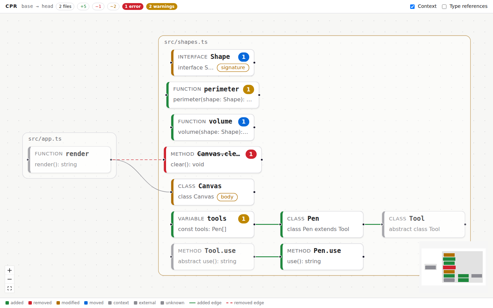
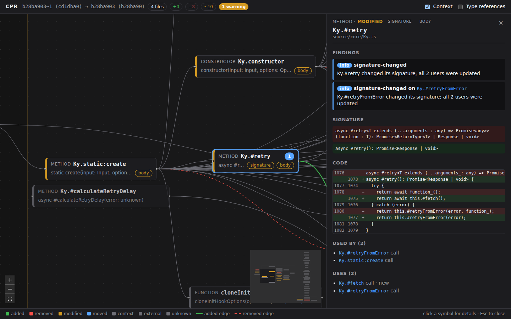

# CPR

Local-first code review that turns a change into a graph of changed symbols and the calls between them, so you review decisions instead of lines.

```sh
cpr diff main            # what changed on this branch, symbol by symbol, with findings
cpr diff main --json     # the graph as JSON (docs/graph-schema.md)
cpr diff main --fail-on error   # for CI
cpr view main            # review it as a graph in the browser
```

```
main (273c27a) → HEAD (b769925), merge-base 273c27a
4 files changed · 3 symbols changed: 1 removed, 1 added, 1 modified

Findings
  ✖ removed-still-referenced  src/math.ts#legacy
      legacy was removed but is still used by 1 symbol: old
  ⚠ signature-changed         src/math.ts#add
      add changed its signature; 1 of 2 users not updated: total

M  src/math.ts
     ~ function    add  (signature, body)  · used by 2
     - function    legacy  · used by 1
     + function    triple
```



The viewer (`packages/viewer`) draws the same graph: one box per file, symbols colored by what
changed, findings as badges, removed edges dashed. `cpr view main` opens it; it also accepts a
graph file from `cpr diff --out` (drag and drop).

Click a symbol to see what changed in it, its findings, and who uses it:



TypeScript and JavaScript for now. Symbols in `fixtures/`, `generated/` and similar folders are not analyzed; add a `.cprignore` (gitignore syntax) to change that.

- [Plan](docs/PLAN.md) · [Journal](docs/JOURNAL.md) · [Graph schema](docs/graph-schema.md)

## Development

Requires Node ≥ 22.12 and pnpm 12.

```sh
pnpm install
pnpm check        # format, lint, typecheck, test
pnpm build        # compile packages to dist/
node packages/cli/dist/bin.js diff main
```

| Package | Role |
|---|---|
| `packages/core` | Analysis engine: git, symbols, diff, references, detectors, graph JSON |
| `packages/cli` | `cpr` command line |
| `packages/viewer` | Graph UI (phase 2) |
| `spikes/ts7` | TypeScript 7 API experiment (outside the workspace) |
