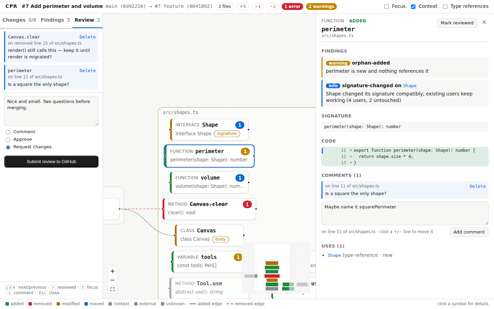

# CPR

Local-first code review that turns a change into a graph of changed symbols and the calls between them, so you review decisions instead of lines.

```sh
cpr diff main            # what changed on this branch, symbol by symbol, with findings
cpr diff main --json     # the graph as JSON (docs/graph-schema.md)
cpr diff main --fail-on error   # for CI
cpr view main            # review it as a graph in the browser
cpr pr 123               # a GitHub pull request or GitLab merge request (cpr mr 123)
```

```
main (273c27a) → HEAD (b769925), merge-base 273c27a
4 files changed · 3 symbols changed: 1 removed, 1 added, 1 modified

Findings
  ✖ removed-still-referenced  src/math.ts#legacy
      legacy was removed but is still used by 1 symbol: old
  ⚠ signature-changed         src/math.ts#add
      add changed its signature; 1 of 2 users not updated: total

M  src/math.ts
     ~ function    add  (signature, body)  · used by 2
     - function    legacy  · used by 1
     + function    triple
```


The viewer (`packages/viewer`) draws the same graph: one box per file, symbols colored by what
changed, findings as badges, removed edges dashed. `cpr view main` opens it; it also accepts a
graph file from `cpr diff --out` (drag and drop).

Large changes stay navigable: a changed symbol with more than 8 unchanged users (or uses) shows
them as one node — "390 users in 220 files" — that opens on click; zoomed out, the canvas is a
map of file names you click to zoom into; and j/k, the change list or a finding take you to a
symbol without anything moving.

Click a symbol to see what changed in it, its findings, and who uses it:


`cpr pr` works with GitHub (and GitHub Enterprise) and GitLab (gitlab.com and self-managed). It
reads the forge from the `origin` remote; tokens come from `GITHUB_TOKEN`/`GH_TOKEN` (or
`gh auth login`) and `GITLAB_TOKEN`.

Under `cpr pr` you can review without leaving the graph: write comments on symbols (press `c`;
click a +/− line to choose where it lands), then submit them from the Review tab as one review —
comment, approve, or request changes. They arrive as inline comments on those lines.

Your reviewed marks and drafts are kept per pull request. When the author pushes again, run
`cpr pr` again: symbols you reviewed that didn't change stay reviewed, the ones that did are
flagged ↻, and your drafts follow their code to its new lines. To see only what the push
changed, compare with the head you saw last — a rebase that touched nothing shows nothing:

```sh
cpr pr 123 --since 3c2b1a0   # each changed symbol: new, updated, or same as in 3c2b1a0
```



In CI, post the findings instead of opening the viewer; findings already posted by an earlier
run are not repeated. Inside a pull/merge request job, `cpr pr` finds the number itself:

```sh
cpr pr --post-findings warning --fail-on error   # GitHub (GITHUB_TOKEN) or GitLab (GITLAB_TOKEN)
```

On GitHub, use the action:

```yaml
on: pull_request
permissions: { contents: read, pull-requests: write }
jobs:
  cpr:
    runs-on: ubuntu-latest
    steps:
      - uses: actions/checkout@v7
        with: { fetch-depth: 0 }
      - uses: attomius321/CPR@main
        with:
          post-findings: warning   # empty: don't post
          fail-on: error           # empty: never fail
```

The action builds CPR, runs it, writes the summary to the run's page, and outputs the graph
JSON's path (`steps.<id>.outputs.graph`) for upload.

On GitLab, include the template:

```yaml
include:
  - remote: https://raw.githubusercontent.com/attomius321/CPR/main/ci/gitlab/cpr.yml
```

Its `cpr` job runs on merge request pipelines. Without a token, findings appear in the merge
request's Code Quality widget; add a masked `GITLAB_TOKEN` variable (api scope) to also get them
as comments on their lines.

TypeScript and JavaScript for now. Symbols in `fixtures/`, `generated/` and similar folders are not analyzed; add a `.cprignore` (gitignore syntax) at the root of your repository to change that. It is read from your working folder, so it applies right away, even uncommitted, and to any commits you compare:

```gitignore
# every `interfaces` folder, at any depth
interfaces/
# only the top-level `tools` folder
/tools/
# but keep this one
!apps/web/interfaces/public.ts
```

### Plugins

Framework knowledge comes as plugins, so the TypeScript/JavaScript analysis stays the same for
every project. A plugin can make CPR see what plain TypeScript cannot: a template that calls a
component's methods, a method the framework calls, decorator settings that are configuration
rather than contract. Turn one on per run or for the repository:

```sh
cpr diff main --plugin angular          # Angular templates, decorators, lifecycle hooks
cpr diff main --plugin ./tools/my-plugin.mjs
```

With `angular`, a template is code: its edits are changes (formatting aside), and what it calls
counts as a use. A method removed while its template still calls it is an error at the template
line; a method used only by a template, a lifecycle hook or a host listener is no orphan; editing
`@Component({ imports })` no longer reads as a new signature. Templates see the repo's components,
directives and pipes too: a removed component still placed, an input renamed while still bound,
an output removed while still listened to, or a pipe whose `transform` changed under a template
that was not updated are reported. With dependencies installed, templates also see the
components, directives and pipes of Angular and its libraries (read from their typings in
`node_modules`): `x$ | async` has a type, so a field read only in `@if (org$ | async; as org)`
counts as used, and `(ngModelChange)="save($event)"` or `#f="ngForm"` are typed — in CI, install
dependencies before CPR runs. In the viewer, a template opens with its own diff, and comments on
its lines go to the `.html` file.

```jsonc
// cpr.config.json, at the repository root (read from your working folder)
{ "plugins": ["angular"] }
```

A short name means `@cpr/plugin-<name>`, found in your project first, then next to cpr; a path
starts with `.` or `/`. In CI: the action's `plugins` input or GitLab's `CPR_PLUGINS` variable
(comma-separated). A plugin that fails is skipped with a warning — it never fails the review.
Writing one: the `TsPlugin` interface exported by `@cpr/core`
([plan](docs/PLAN.md#x1--plugins)), and a complete example in
[`tpl-plugin.ts`](packages/core/test/helpers/tpl-plugin.ts).

- [Plan](docs/PLAN.md) · [Journal](docs/JOURNAL.md) · [Graph schema](docs/graph-schema.md)

## Development

Requires Node ≥ 22.12 and pnpm 12.

```sh
pnpm install
pnpm check        # format, lint, typecheck, test
pnpm build        # compile packages to dist/
node packages/cli/dist/bin.js diff main
```

| Package | Role |
|---|---|
| `packages/core` | Analysis engine: git, symbols, diff, references, detectors, graph JSON |
| `packages/cli` | `cpr` command line |
| `packages/viewer` | Graph UI (phase 2) |
| `spikes/ts7` | TypeScript 7 API experiment (outside the workspace) |
